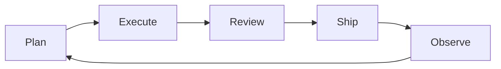

# Engineer Work Matrix

This document captures what a software engineer needs to complete daily work accurately, and maps which parts Codex/Claude can solve or accelerate.

**At A Glance**



**Configuration + Storage Surfaces**

Universal reference for where configuration and state live across the extension and webview.

| Surface | Owner | API | Scope | Guidance |
| --- | --- | --- | --- | --- |
| Env files | Extension | `.env.local`, `.env` parsing | Workspace | Dev bootstrap only; never required at runtime |
| Env vars | Extension | `process.env` | Process | Use for non-secret defaults |
| Settings | Extension | `workspace.getConfiguration()` | User/workspace | Canonical user intent (`atlassian.*`) |
| Secrets | Extension | `context.secrets` | Global | Tokens and credentials only |
| Global state | Extension | `context.globalState` | Global | Small flags, restart markers |
| Workspace state | Extension | `context.workspaceState` | Workspace | Workspace-scoped flags |
| File storage | Extension | `workspace.fs` + storage URIs | Global/workspace | Large caches, snapshots |
| Webview local state | Webview | `vscodeApi.getState/setState` | Per webview | UI-only, small state |
| Webview storage | Webview | `localStorage` / `sessionStorage` | Per webview origin | UI-only cache, no secrets |
| Webview IndexedDB | Webview | `indexedDB` | Per webview origin | UI-only cache, no secrets |
| SQLite | Extension | SQLite client | Workspace/global | Structured caches |
| Remote DB | Extension | HTTP client | Global | External persistence |

**Daily Job Matrix**

| Area | Goal | Inputs Needed | Outputs | Quality Bar | Codex/Claude Role |
| --- | --- | --- | --- | --- | --- |
| Planning | Choose correct work | Roadmap, backlog, priorities | Selected tasks | Aligned with team goals | Summaries + ranking |
| Execution | Build correctly | Repo, tests, specs | Code + tests | Passes tests, correct behavior | Draft patches + tests |
| Review | Reduce risk | Diff, context, runtime signals | Approvals, fixes | No critical regressions | Risk scan + checklist |
| Ship | Release safely | CI, deploy config | Release + notes | Rollback ready | Draft notes |
| Observe | Catch issues | Metrics, logs, alerts | Actions, fixes | SLA met | Alert summaries |
| Communicate | Keep team aligned | Status, blockers | Updates | Timely, clear | Draft updates |

**Planning Matrix**

| Step | Inputs | Decision | Artifact |
| --- | --- | --- | --- |
| Scope | Roadmap, KPIs | What matters now | Sprint goal |
| Decompose | Feature spec | Task breakdown | Tasks + estimates |
| Sequence | Dependencies | Order of work | Plan |
| Risk | Past incidents | Mitigations | Risk list |
| Align | Team capacity | Commitments | Owner map |

**Execution Matrix**

| Step | Inputs | Action | Artifact | Codex/Claude Role |
| --- | --- | --- | --- | --- |
| Understand | Codebase, docs | Read + inspect | Notes | Summaries + pointers |
| Implement | Tasks, design | Code changes | PR | Draft changes |
| Validate | Tests, linters | Run checks | Green CI | Suggest tests |
| Integrate | Reviews, fixes | Resolve feedback | Updated PR | Patch revisions |
| Merge | Approved PR | Merge | Release | Draft release notes |

**Project Management Matrix**

| Area | Inputs | Actions | Outputs |
| --- | --- | --- | --- |
| Backlog | Issues, requests | Triage, label | Ordered backlog |
| Scheduling | Capacity, priority | Plan sprint | Sprint board |
| Risk | Dependencies | Mitigate | Risk register |
| Status | Progress signals | Update | Stakeholder report |

**Codex/Claude Capability Matrix**

| Task | Can Automate | Needs Human | Inputs Required | Safety Gate |
| --- | --- | --- | --- | --- |
| Summarize issues/PRs | Yes | Approvals | Diff, comments | Review |
| Draft tasks from text | Yes | Final review | Text + context | Confirm |
| Generate test cases | Yes | Final review | Code + spec | Review |
| Implement small changes | Yes | Review + merge | Repo + target | Review |
| Propose refactor | Yes | Approval | Codebase | Approval |
| Runbooks execution | Yes | Confirmation | Runbook + scope | Confirm |
| CI triage | Yes | Decision | Logs + failures | Confirm |
| Incident update draft | Yes | Approval | Incident data | Approval |
| Sprint status | Yes | Approval | Activity signals | Approval |
| Architecture decisions | No | Yes | Domain context | Human only |
| Security approvals | No | Yes | Policy context | Human only |

**Runtime State Persistence**

Config and state are separate concerns. Config = user intent (TOML, human-editable). State = runtime data (JSON, machine-written).

| File | Format | Purpose | Lifecycle |
| --- | --- | --- | --- |
| `config/universal.toml` | TOML | Structural contract (stages, routes, commands) | Rarely changes, human-editable |
| `_agents/config.local.toml` | TOML | Workspace config overrides | Rarely changes, human-editable |
| `_agents/state.json` | JSON | Runtime state (triage, summaries, timestamps) | Written every automation run |

State schema (`AppPersistedState`):

| Section | Written By | Read By | Stage |
| --- | --- | --- | --- |
| `triage` | `runTriage()` — Jira API fetch + `statusToBucket()` | Plan daily page (NOW/NEXT/WAITING) | Plan |
| `dailyFocus` | Future: daily-focus automation | Plan daily page (AI summary) | Plan |
| `weeklyReview` | Future: weekly-summary automation | Weekly review screen | Plan (meso) |
| `prRiskCheck` | Future: pr-review-assist automation | Review page (risk checklist) | Review |
| `releaseNotes` | Future: release-notes automation | Ship page (draft notes) | Ship |

**Automation → Display Pipeline**

```
Automation TOML config (rrule schedule or manual trigger)
  → Codex/Claude executes runbook
  → Writes result to _agents/state.json (specific section)
  → File watcher detects change
  → Extension reads updated state
  → Pushes to webview via event
  → UI component for that state section re-renders
```

Each automation maps to: **TOML config** → **state section** → **UI component** → **stage route**.

**Automation Strategy**

| Stage | What To Automate First | Why | Gate |
| --- | --- | --- | --- |
| Planning | Summaries, task drafts | Reduces prep time | Confirm |
| Execution | Small code changes | Safe and fast | Review |
| Review | Diff analysis, test suggestions | Reduces risk | Review |
| Ship | Release notes | Low risk, high value | Approve |
| Observe | Log summaries | Faster response | Confirm |
| Communicate | Status drafts | Reduces overhead | Approve |

**Reactive vs Scheduled Automation**

Individual rrule schedules handle rituals. But most engineering work is event-driven. The automation system uses three trigger types:

| Trigger | When | Examples | Muscle Memory |
| --- | --- | --- | --- |
| Event | Something happened | PR opened, issue transitioned, branch switched | System reacts, user confirms |
| Schedule | Ritual cadence | Daily triage 9am, weekly summary Friday | System prepares, user reviews |
| Chain | Automation output | Triage → focus summary → notification | System flows, user gates at end |

Workflows (not individual automations) are the right unit. See `docs/reactive-workflows.md` for the full model.

**Context Switching Support**

Engineers lose significant time context-switching. The system preserves context automatically:

| Switch | System Preserves | Restore |
| --- | --- | --- |
| Branch switch | Branch → issue mapping, last files | Auto-show linked issue |
| Meeting interrupt | Open files, active issue, branch | "Resume" button |
| Day boundary | Triage state, NOW bucket | Auto-load on app open |
| Sprint boundary | Weekly summary | Weekly review screen |
| Incident interrupt | Current task pushed to stack | "Back to task" after |
