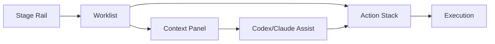

# Lifecycle UI With Codex/Claude

This document describes the UI layout for the lifecycle stages and how Codex/Claude accelerates each step without hiding critical decisions.

**UI Layout**



**Layout Rules**

1. The primary action always appears in the same location.
2. Stage navigation never moves the action stack.
3. AI suggestions are visible but never auto‑executed without confirmation.

**UI Zones**

| Zone | Purpose | Always Visible | Notes |
| --- | --- | --- | --- |
| Stage Rail | Plan → Execute → Review → Ship → Observe | Yes | Number keys for muscle memory |
| Worklist | Now / Next / Waiting | Yes | Stable ordering |
| Action Stack | Primary + 1–3 secondary | Yes | Constant position |
| Context Panel | Details and history | Optional | Expands on focus |
| AI Assist | Drafts, summaries, checklists | Optional | One click to accept |

**Codex/Claude Integration By Stage**

| Stage | AI Role | Typical Trigger | Output | Human Gate |
| --- | --- | --- | --- | --- |
| Plan | Summarize + rank | Open app or triage | Ranked tasks | Confirm selection |
| Execute | Draft code/tests | Open task or diff | Patch + tests | Review + edit |
| Review | Risk scan | PR opened | Checklist + notes | Approve or request changes |
| Ship | Release summary | Release ready | Notes + impact | Approve publish |
| Observe | Signal triage | Alert arrives | Summary + next steps | Confirm action |

**Automation Modes**

| Mode | What It Does | Default Use |
| --- | --- | --- |
| Assist | Drafts and suggestions only | Always safe |
| Guided | Executes after explicit confirmation | Use for routine tasks |
| Auto | Executes without confirmation | Reserved for low‑risk ops |

**Muscle Memory Keys**

| Key | Action |
| --- | --- |
| `1` | Plan |
| `2` | Execute |
| `3` | Review |
| `4` | Ship |
| `5` | Observe |
| `Enter` | Run primary action |
| `Shift+Enter` | Run secondary action |
| `Escape` | Dismiss / go back |

**Interaction Rhythm (Every Stage)**

Every stage follows the same loop — content changes, rhythm never does:

```
See the list → Pick an item → See the detail → Take the action → See the result
```

This **See → Pick → Detail → Act → Result** loop is the core muscle memory pattern. Keyboard: `1-5` to see, arrow/click to pick, space to detail, `Enter` to act.

**Primary Action By Stage**

| Stage | `Enter` Does | `Shift+Enter` Does |
| --- | --- | --- |
| Plan | Start top task | Run Triage |
| Execute | Resume current task | Run Tests |
| Review | Address top feedback | Open PR |
| Ship | Release | Draft Notes |
| Observe | Respond to top alert | Classify |

**Example: Execute Stage**

| Slot | Action | AI Assist |
| --- | --- | --- |
| Primary | Resume Task | Generate patch |
| Secondary | Run Tests | Draft test plan |
| Secondary | Open PR | Draft PR summary |

**Reactive Display Patterns**

Every stage follows the same reactive pipeline: automation writes state, UI reads and renders.

```
Automation (rrule trigger or user action)
  → Writes result to _agents/state.json
  → File watcher detects change
  → Extension reads new state section
  → Pushes update to webview via event
  → Webview reactively renders
```

| Pattern | Implementation | Rationale |
| --- | --- | --- |
| Reactive loading | Auto-fetch on mount, show cached immediately, refresh in background | No empty states, no manual refresh |
| Staleness signals | Subtle timestamp + "Refresh" affordance, never auto-refetch | User stays in control of API calls |
| Role-based views | Same data, different lens (dev=worklist, PM=capacity, lead=risk) | Matches engineer-work-matrix roles |
| Progressive disclosure | List → detail → full Jira (Open in Jira) | Each click adds depth, never overwhelms |
| Event-driven updates | File watcher on `_agents/state.json`, webview message bus | State changes propagate without polling |
| Automation transparency | Every AI insight shows its source and trigger | Users trust what they can inspect |

**Reactive Display By Stage**

| Stage | What Auto-Loads | State Section | Design Principle |
| --- | --- | --- | --- |
| Plan | Triage (NOW/NEXT/WAITING), daily focus summary, staleness indicator | `triage`, `dailyFocus` | Opinionated defaults, zero clicks to value |
| Execute | Current branch → linked issue context, automation status dashboard | `activeWork` | Ambient awareness without interruption |
| Review | Sprint issue list, AI risk checklist, related PRs + CI status | `triage`, `prRiskCheck` | Contextual depth on demand |
| Ship | Release notes draft, deployment checklist, readiness status | `releaseNotes` | Confidence before action |
| Observe | Deploy timestamp, error rate delta, weekly retrospective summary | `weeklyReview` | Reflection without effort |

**State Sections → UI Components**

Each automation TOML config maps to:

1. A **state section** in `AppPersistedState` (e.g., `triage`, `dailyFocus`, `weeklyReview`)
2. A **UI component** that reads that section
3. A **stage route** where that component renders

Currently implemented:
- `triage` → `WorklistSection` (NOW/NEXT/WAITING) → Plan daily page
- Sprint issues → `IssueRow` list → Review page

**Lifecycle Reminders**

Reminder screens are defined in `docs/project-management-matrix.md`.
