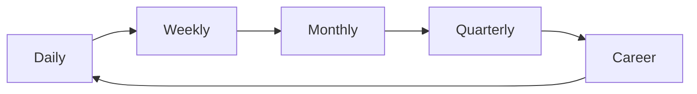

# Project Management and Lifecycle Matrix

This document defines the cadence, communication, and reminder system from daily execution to long‑term career growth.

**At A Glance**



**Configuration + Storage Surfaces**

Universal reference for where configuration and state live across the extension and webview.

| Surface | Owner | API | Scope | Guidance |
| --- | --- | --- | --- | --- |
| Env files | Extension | `.env.local`, `.env` parsing | Workspace | Dev bootstrap only; never required at runtime |
| Env vars | Extension | `process.env` | Process | Use for non-secret defaults |
| Settings | Extension | `workspace.getConfiguration()` | User/workspace | Canonical user intent (`atlassian.*`) |
| Secrets | Extension | `context.secrets` | Global | Tokens and credentials only |
| Global state | Extension | `context.globalState` | Global | Small flags, restart markers |
| Workspace state | Extension | `context.workspaceState` | Workspace | Workspace-scoped flags |
| File storage | Extension | `workspace.fs` + storage URIs | Global/workspace | Large caches, snapshots |
| Webview local state | Webview | `vscodeApi.getState/setState` | Per webview | UI-only, small state |
| Webview storage | Webview | `localStorage` / `sessionStorage` | Per webview origin | UI-only cache, no secrets |
| Webview IndexedDB | Webview | `indexedDB` | Per webview origin | UI-only cache, no secrets |
| SQLite | Extension | SQLite client | Workspace/global | Structured caches |
| Remote DB | Extension | HTTP client | Global | External persistence |

**Lifecycle Layers**

| Layer | Horizon | Primary Goal | Inputs | Outputs |
| --- | --- | --- | --- | --- |
| Micro | Daily | Deliver today’s outcomes | Tasks, blockers, PRs | Completed work |
| Meso | Weekly | Maintain momentum | Sprint plan, backlog | Sprint progress |
| Macro | Monthly/Quarterly | Deliver outcomes | Initiatives, KPIs | Milestones shipped |
| Career | 1–2 years | Grow impact | Portfolio, feedback | Growth plan |

**Initiatives and Projects**

| Level | Artifact | Owner | Cadence | Success Signal |
| --- | --- | --- | --- | --- |
| Initiative | Strategy brief | Lead | Quarterly | KPI movement |
| Project | Plan + milestones | PM/Lead | Monthly | Milestones hit |
| Sprint | Sprint plan | Team | Weekly | Scope delivered |
| Task | Ticket | IC | Daily | Completion |

**Communication Matrix**

| Audience | Cadence | Channel | Default Message |
| --- | --- | --- | --- |
| Team | Daily/Weekly | Standup/Slack | Today, blockers, help needed |
| Stakeholders | Weekly/Biweekly | Doc/Email | Progress, risks, ETA |
| Leadership | Monthly/Quarterly | Memo | Outcomes, learnings, next bets |
| Self | Monthly | Journal | Wins, gaps, growth focus |

**Cyclical Maintenance**

| Cycle | Purpose | Routine |
| --- | --- | --- |
| Daily | Keep flow | Triage → Execute → Review |
| Weekly | Adjust priorities | Plan + Retro + Groom |
| Monthly | Re-calibrate | Roadmap check + risk sweep |
| Quarterly | Reset direction | OKR review + initiative scoring |

**Cycle Feedback Loops**

Work is cyclical. Output from later cycles feeds into earlier ones automatically:

```
Daily output → Weekly input (carry-over items get higher priority)
Weekly output → Monthly input (velocity trend informs capacity)
Monthly output → Quarterly input (initiative progress informs bets)
Observe output → Daily input (incident patterns become risk items)
Review output → Execute input (PR feedback patterns become quality rules)
```

| From Cycle | To Cycle | Signal | Auto-Generated Artifact |
| --- | --- | --- | --- |
| Daily | Weekly | Unfinished items | Carry-over list with priority bump |
| Weekly | Monthly | Velocity trend | Capacity forecast |
| Monthly | Quarterly | Initiative drift | Priority re-alignment suggestions |
| Quarterly | Career | Stretch work gaps | Growth flag + suggestions |
| Observe | Daily | Incident patterns | Risk items added to triage |
| Review | Execute | Repeated PR feedback | Quality rule suggestions |

These loops are automated: the system detects the signal, generates the artifact, and surfaces it at the right time in the right stage. The user confirms, not creates.

**Reminder Screens**

| Screen | Trigger | Primary CTA | Key Widgets |
| --- | --- | --- | --- |
| Daily Focus | App open | Start top task | Top 3 outcomes, blockers |
| Weekly Review | End of week | Plan next week | Wins, misses, risk list |
| Monthly Check‑in | Month end | Re‑align priorities | Initiative progress, drift |
| Quarterly Reset | Quarter end | Commit next bets | KPI review, milestones |
| Career Growth | Monthly | Update growth plan | Skills, feedback, stretch work |

**Automation Assist (Codex/Claude)**

| Layer | Assist | Output | Gate |
| --- | --- | --- | --- |
| Daily | Triage + prioritization | Ranked task list | Confirm |
| Weekly | Summary + risk sweep | Weekly update | Approve |
| Monthly | Drift detection | Priority suggestions | Confirm |
| Quarterly | Initiative scoring | Next bet options | Approve |
| Career | Growth suggestions | Goals + actions | Review |

**Signals That Trigger Reminders**

| Signal | Example | Screen |
| --- | --- | --- |
| Blockers exceed threshold | 3+ blocked tasks | Daily Focus |
| Sprint drift | 20% scope at risk | Weekly Review |
| Initiative slippage | Milestone missed | Monthly Check‑in |
| KPI regression | Metric down for 2 cycles | Quarterly Reset |
| Growth gap | No stretch work in 60 days | Career Growth |

**Reactive Automation Pipeline**

Each lifecycle layer maps to an automation that writes state, which the UI reads reactively.

```
Lifecycle Layer → Automation TOML → State Section → UI Screen
  Daily         → daily-focus      → triage        → Plan daily (NOW/NEXT/WAITING)
  Weekly        → weekly-summary   → weeklyReview   → Weekly Review (Wins/Misses/Risks)
  Monthly       → (manual)         → monthlyCheckin  → Monthly Check-in
  Quarterly     → (manual)         → quarterlyReset  → Quarterly Reset
  Career        → (manual)         → careerGrowth    → Career Growth
```

| Layer | Automation | Trigger | State Written | UI Output |
| --- | --- | --- | --- | --- |
| Daily | `runTriage()` | Manual + app open (cached) | `triage.issues[]` with NOW/NEXT/WAITING buckets | Worklist sections on Plan page |
| Daily | `daily-focus` (future) | rrule: `FREQ=DAILY;BYHOUR=9` | `dailyFocus.summary`, `dailyFocus.topIssues` | AI summary card on Plan page |
| Weekly | `weekly-summary` (future) | rrule: `FREQ=WEEKLY;BYDAY=FR` | `weeklyReview.wins`, `.misses`, `.risks` | Weekly Review screen |
| Monthly | Manual | Month-end prompt | `monthlyCheckin.initiatives`, `.drift` | Monthly Check-in screen |
| Quarterly | Manual | Quarter-end prompt | `quarterlyReset.kpis`, `.scorecard` | Quarterly Reset screen |

**Implemented: Daily Triage**

The daily micro layer is live:
- `runTriage()` fetches sprint issues from Jira, categorizes via `statusToBucket()`, persists to `_agents/state.json`
- Plan page auto-loads cached triage on mount — no empty state on return visits
- Issues in NOW (In Progress, In Review, Doing), NEXT (To Do, Open, New), WAITING (Blocked, On Hold)
- Clicking any issue navigates to `/review/issues/{KEY}` for full detail

**Signal → Automation → Display Flow**

Signals from `project-management-matrix` now connect to the reactive system:

| Signal | Threshold | Automation Response | Display |
| --- | --- | --- | --- |
| Blockers exceed threshold | 3+ blocked tasks | Triage highlights WAITING bucket | Red count badge on Plan |
| Sprint drift | 20% scope at risk | Weekly summary flags risk | Risk section on Weekly Review |
| Initiative slippage | Milestone missed | Monthly check-in drift signal | Drift card on Monthly screen |
| KPI regression | Metric down 2 cycles | Quarterly reset KPI review | KPI delta on Quarterly screen |
| Growth gap | No stretch work 60d | Career growth flag | Alert on Career Growth screen |

**Related Docs**

- `docs/reminder-ui.md`
- `docs/lifecycle-ui.md`
- `docs/engineer-work-matrix.md`
