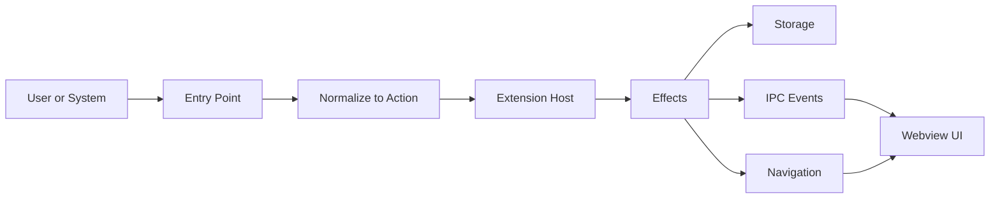
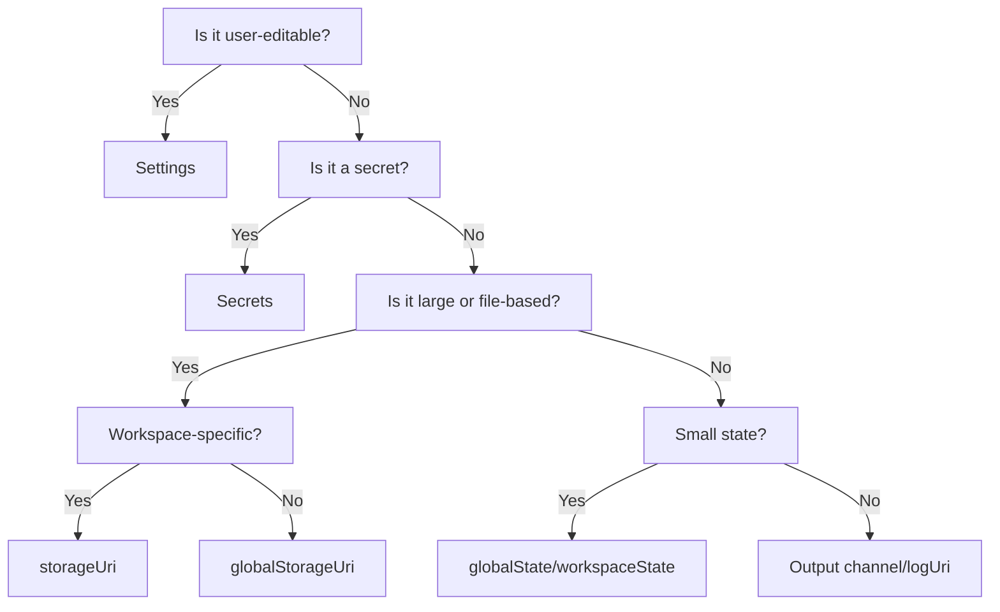

# Universal Routing Matrix

This is the visual map for how the extension behaves from a user’s action to the UI and storage.

**At A Glance**



**Why This Exists**

1. One consistent flow from entry point to storage and UI.
2. Clear ownership: the extension host owns state, the webview requests it.
3. Predictable behavior across VS Code webview and browser dev mode (WS bridge).

**The One Path**

1. Something happens: command, deep link, tree click, webview action.
2. Normalize it into an `Action`.
3. The extension host runs handlers (RPC + command handlers).
4. Handlers update storage and/or navigation.
5. The webview renders the result.

## Canonical Contracts

### Actions (User Intent)

Actions are stable IDs for user intent. They can map to VS Code commands, RPC methods, and/or a default route.

Source of truth: `src/shared/contracts/commands.ts` (`ACTIONS`).

```ts
export type ActionDefinition = {
  id: string;
  rpc?: string;
  vscode?: string;
  route?: string;
  description?: string;
};
```

### Routes

Route hints are the universal navigation payload used by deep links and internal routing.

```ts
export type RouteHint = {
  name?: string;
  path?: string;
  issueKey?: string;
  query?: Record<string, string>;
};
```

### URL State (Query Params)

The route **path** answers "where am I?" and the route **query** answers "what state is this UI in?"

Goal: any meaningful page/component interaction state should be representable as a stable URL:

- Shareable (copy/paste)
- Bookmarkable
- Deterministic to reproduce (debug artifact)

**Rule of thumb**

| State Type | Put In URL Query? | Examples |
| --- | --- | --- |
| View/layout selection | Yes | `view=compact`, `tab=comments` |
| Filters/search/sort | Yes | `q=error`, `sort=updated-desc` |
| Pagination | Yes | `page=2` |
| Expanded sections | Usually yes | `open=matrix.operations` |
| Secrets/credentials | Never | API tokens |
| Large payloads | No | big JSON; store elsewhere and pass an ID/pointer |
| High-frequency transient UI | Usually no | hover state, scroll, toasts |

**Recommended query keys**

| Key | Meaning |
| --- | --- |
| `q` | Free-text filter/search |
| `view` | Layout mode |
| `tab` | Sub-surface selection |
| `open` | Dot-separated list of expanded section IDs (CSV accepted) |
| `focus` | Focus anchor (scroll/highlight) |

**Anchors**

Prefer query params (`focus=...`, `anchor=...`) over URL fragments:

- The browser wrapper already uses `#` for SPA routing.
- VS Code URI handlers typically ignore fragments unless explicitly forwarded.

### Unified Link Parsing (`parseAnyLink`)

`parseAnyLink(input)` from `src/shared/link/parse-any-link.ts` is the single "paste anything" parser for all link formats. It replaces the older `parseNavTarget` (now a deprecated thin wrapper).

**Signature:**

```ts
export const parseAnyLink = (input: string): ParsedLink | null;

export interface ParsedLink {
  to: string;                          // resolved app route path
  search: Record<string, string>;      // app-owned query params (wrapper params stripped)
  display: string;                     // human-readable string for omnibox
  canonicalIntent?: string;            // canonical intent URL when input was an intent
  passthrough?: URLSearchParams;       // wrapper params preserved for reconstruction
}
```

**Accepted input formats:**

| Format | Example |
| --- | --- |
| Canonical intent | `app://atlassian/route/plan` |
| Legacy intent | `atlassian://route/plan` |
| VS Code deep link | `vscode://publisher.atlassian/open/plan` |
| VS Code Insiders deep link | `vscode-insiders://publisher.atlassian/open/plan` |
| HTTP/localhost dev URL | `http://localhost:5173/#/plan?view=compact` |
| Hash route | `#/plan?view=compact` |
| Raw path | `/plan` |
| Legacy deep link path | `/open/plan`, `/openApp/plan` |
| Dispatcher wrapper | `/app/atlassian/route/plan` |
| Legacy redirect | `/jira/ABC-123` -> `/review/issues/ABC-123` |

**Parser priority:** (1) universal intent URL, (2) hash routes, (3) full URLs (vscode/http/https with hash or path resolution), (4) raw paths with `resolveRouteFromDeepLink` fallback.

### Link Formatting (`formatLink`)

`formatLink(parsed, format, opts?)` from `src/shared/link/format.ts` converts a `ParsedLink` into one of 4 output formats:

```ts
export type LinkFormat = "canonical" | "dispatcher" | "deepLink" | "webHash";

export const formatLink = (
  parsed: ParsedLink,
  format: LinkFormat,
  opts?: FormatOptions,
): string;
```

| Format | Output Example |
| --- | --- |
| `canonical` | `app://atlassian/route/plan?view=compact` |
| `dispatcher` | `/app/atlassian/route/plan?view=compact` |
| `deepLink` | `vscode://albertyang.atlassian-sprint-view/app/atlassian/route/plan?view=compact` |
| `webHash` | `#/plan?view=compact` |

`FormatOptions` allows overriding `appId` (default `"atlassian"`), `scheme` (default `"app"`), and `extensionId` (default `"albertyang.atlassian-sprint-view"`).

### Owned Query Params vs VS Code Wrapper Params

VS Code webviews add internal wrapper query params to the base document URL (`id`, `parentId`, `origin`, `swVersion`, etc.). These must be treated as transport implementation detail:

- never include them in app deep links (copy/share)
- never treat them as router/search state
- never display them in the omnibox/registry

Only app-owned query keys are part of the public routing/state contract.

**Wrapper key extraction:** `INTERNAL_WRAPPER_QUERY_KEYS` and `isInternalWrapperQueryKey()` in `src/shared/link/wrapper-keys.ts` define the known set: `id`, `parentid`, `origin`, `swversion`, `extensionid`, `platform`, `vscode-resource-base-authority`, `parentorigin`, plus any key with a `vscode-` prefix (case-insensitive). `parseAnyLink` strips these automatically, returning app-owned params in `ParsedLink.search` and wrapper params in `ParsedLink.passthrough` for round-trip reconstruction.

### URL State Utilities

`src/shared/link/url-state.ts` provides helpers that operate on the `UrlStateConfig` registry (declared in `config/universal.toml` under `[urlState.*]`):

| Function | Purpose |
| --- | --- |
| `validateUrlParam(key, value, config)` | Check if a value is valid for a declared param (type-aware: enum/boolean/number/string) |
| `sanitizeUrlState(params, config)` | Filter params to known keys, drop invalid values, fill defaults |
| `getUrlStateDefaults(config)` | Return default values for all params that declare one |
| `getOmniboxHints(config)` | Build autocomplete hints (key, values, description) for omnibox |

**Implementation (TanStack Router + nuqs)**

Prefer `nuqs` for type-safe query-state that behaves like `useState` but persists in the URL.

- Wrap the app root with `NuqsAdapter` (TanStack Router adapter).
- Use `useQueryState` / `useQueryStates` inside pages/components.
- Use `history: "replace"` for typing-like updates, and `history: "push"` for discrete navigation steps.
- The `history` mode for each param is declared in `config/universal.toml` (e.g., `[urlState.view] history = "replace"`).

### Route Path vs Dispatcher Path

Two path formats exist throughout the routing stack. Mixing them up is the primary source of double-prefix bugs (`/app/atlassian/route/app/atlassian/route/...`).

| Concept | Format | Example | Used By |
| --- | --- | --- | --- |
| **Route path** | `/{stage}/{rest}` | `/plan`, `/review/issues/ABC-123` | TanStack Router, `normalizeRoutePath()`, `routeHintToPath()` |
| **Dispatcher path** | `/app/{appId}/{kind}/{rest}` | `/app/atlassian/route/plan` | Deep links, URL bar, `parseAnyLink()`, `/app/$` route |

**Rules:**
- `normalizeRoutePath()` operates on *route* paths only. Never pass a dispatcher path.
- `buildAppDispatcherPath(appId, routePath)` wraps a route path → dispatcher path.
- `isAppDispatcherPath(path)` checks if a path is already in dispatcher format.
- `buildDeepLinkUrl()` does NOT normalize — callers must provide the correct format.

### Deprecated: `parseNavTarget`

`src/webview/src/lib/parse-nav-target.ts` is **deprecated**. It is now a thin wrapper that delegates to `parseAnyLink` and returns only the `to` path. All new code should use `parseAnyLink` directly from `@shared/link` to get the full `ParsedLink` (route, search params, display string, passthrough).

### IPC Envelope (Transport-Agnostic)

Both transports use the same envelope:
- VS Code webview: `webview.postMessage(...)`
- Browser dev mode: WS bridge (`ws://127.0.0.1:5174/?token=...`)

```ts
export type IpcEnvelope =
  | { kind: "rpc"; payload: string }
  | { kind: "event"; name: string; payload?: unknown }
  | { kind: "command"; name: string; payload?: unknown };
```

JSON-RPC is carried inside `kind: "rpc"` messages. Commands/events use `kind: "command"` / `kind: "event"`.

### WebSocket Notes (Node vs Bun vs Browser)

- **Inside VS Code:** keep using `webview.postMessage(...)` as the primary transport (no ports, no CSP/proxy issues).
- **External/browser clients:** WS is the pragmatic transport, but remember:
  - Browsers cannot set arbitrary headers on the WebSocket handshake. If you need auth, use a short-lived token via HTTPS then connect with `?token=...`, or use cookies/subprotocol negotiation.
  - Node has a browser-compatible `WebSocket` *client* on the global object; it is stable in modern Node versions, but Node still does not ship a WebSocket *server* API, so you typically keep using `ws` (or similar) for server-side. See Node docs for `WebSocket` history.
  - Bun provides built-in server-side WebSockets via `Bun.serve({ websocket: ... })`, supports per-message compression, idle timeouts, and payload limits, and its WebSocket client supports custom headers (Bun-specific; not browser compatible).

## Routing Map

| Entry Point | Parser | Action Type | Storage Reads/Writes | IPC/Navigation | Notes |
| --- | --- | --- | --- | --- | --- |
| Deep link | URI handler → `parseAnyLink` → `ParsedLink` | `atlassian.app.open` + `atlassian.route.navigate` | Read settings/auth state | IPC command `atlassian.route.navigate` | External routing entry; `parseAnyLink` replaces direct `RouteHint` construction |
| Command palette | VS Code commands → `ACTIONS` | `atlassian.openApp`, `atlassian.refresh`, etc | Read/write settings/secrets/state | IPC commands and RPC | Primary user entry points |
| Tree item click | `TreeItem.command` | `atlassian.issue.open` | Read issue details | Navigate to `/review/issues/:key` | UI-driven navigation |
| Webview UI action | UI → RPC/commands | `ACTIONS.*` | Write secrets/settings/state | RPC + IPC `atlassian.state.updated` | UI never directly writes files/secrets |
| Browser dev UI | WS bridge | Same as webview | Same | Same envelopes | Dev-only transport; auth token required |
| Activation | `activate()` | bootstrap | Read settings/secrets/state | initial state via RPC | Initializes caches and UI |

## Deep Links

Deep links are environment-specific only in the **base** (scheme + extension id). The route path is universal.

- Base: `${uriScheme}://${extensionId}`
  - Examples: `vscode://...`, `vscode-insiders://...`
- Primary: `/app/<appId>/<kind>/<target>?...`
  - Example: `/app/atlassian/route/plan`
- Legacy (route-only convenience): `/open/<route>`
  - Example: `/open/plan` or `/open/review/issues/ABC-123`

The easiest way to confirm your current base + examples is **System → Registry**.

### Deep Link URL Construction

The deep link shown in the URL bar is built from these helpers in `src/shared/contracts/routes.ts`:

| Helper | Purpose |
| --- | --- |
| `buildDeepLinkBase(uriScheme, extensionId)` | Builds the base URL prefix (VS Code: `vscode-insiders://pub.ext`; browser: computed from `window.location.origin + "#"`) |
| `buildAppDispatcherPath(appId, routePath)` | Wraps a route path in the dispatcher format: `/plan` → `/app/atlassian/route/plan` |
| `isAppDispatcherPath(path)` | Returns `true` when a path is already dispatcher-wrapped (avoids double-wrapping) |
| `buildDeepLinkUrl(base, path, query?)` | Joins base + path + query into a full URL. **Does not normalize** — callers provide well-formed paths. |

**Surface-aware base selection** (in `App.tsx`): The deep link base is chosen by *surface* (presence of `acquireVsCodeApi`), not by host connectivity. This means:
- VS Code webview surface → `vscode-insiders://extensionId/...`
- Browser surface (even when WS bridge is connected) → `http://localhost:5173/#/...`

This prevents the URL bar from unexpectedly flipping to `vscode://` when the WS bridge connects in the browser.

### Deep Link Navigation Flow (Extension → Webview)

When a user clicks a deep link (e.g., `vscode-insiders://ext/app/atlassian/route/system/registry`):

```
1. VS Code calls AtlassianUriHandler.handleUri(uri)
2. URI handler parses via parseAnyLink(uri) → { to: "/system/registry" }
3. Calls deps.navigate() FIRST → sets ViewProviderPanel.initialRoute + pendingRoute
4. Calls deps.showApp() → creates/reveals the panel
   ├─ If panel is freshly created → resolveWebviewView() builds HTML
   │  └─ injectInitialRoute() embeds hash + window.__atlassianRoute in HTML
   │     (always overrides existing hash — explicit navigation takes priority)
   ├─ If panel already open + webview ready → postPendingRoute() sends IPC NAVIGATE
   └─ If panel rebuilding → pendingRoute sent when WEBVIEW_READY fires
5. App.tsx reads window.__atlassianRoute on mount (fallback for first load)
6. IPC NAVIGATE command arrives → TanStack Router navigates to target
```

**Key ordering invariant:** `navigate()` is called before `showApp()` so that `initialRoute` is set before the HTML is built.

**Dispatcher path unwrapping:** `resolveRouteFromDeepLink` automatically unwraps `route` kind dispatcher paths (`/app/{appId}/route/{path}` → `/{path}`) so the webview navigates directly to the inner route. Non-route kinds (`action`, `command`, `rpc`) keep the `/app/...` prefix and navigate to the dispatcher confirmation page. This ensures `injectInitialRoute` can embed the route hash.

### Query State In Deep Links

Query params are part of the universal route contract and should be preserved through all wrappers:

- Canonical meaning link: `app://<appId>/route/<path>?k=v`
- VS Code wrapper: `${uriScheme}://${extensionId}/app/<appId>/route/<path>?k=v`
- Browser wrapper: `http://localhost:5173/#/app/<appId>/route/<path>?k=v`

### Canonical Universal URLs (Meaning-Only)

To keep links consistent across environments, we also support a canonical universal URL format:

- `app://<appId>/route/<path>?k=v`
- `app://<appId>/doc/<id>`
- `app://<appId>/runbook/<id>`
- `app://<appId>/skill/<id>`
- `app://<appId>/command/<vscodeCommandId>?args=[...]`
- `app://<appId>/rpc/<method>?args=[...]`

These **do not replace** transport schemes (`vscode://`, `http(s)://`, `ws://`). Instead:

- VS Code wrapper (opens the extension): `${uriScheme}://${extensionId}/app/<appId>/<kind>/<target>?...`
- Browser dev wrapper: `http://localhost:5173/#/app/<appId>/<kind>/<target>?...`

Legacy note: `/intent?u=...` still exists as a redirect for old links, but the canonical dispatcher is `/app/...`.

For safety, command-like intents (`command`/`rpc`/`action`) require user confirmation on the `/app/...` dispatcher page.

The canonical scheme is configurable via `config/universal.toml` (default is `app`):

```toml
[app]
id = "atlassian"
intentScheme = "app"
```

**Where Data Lives**

| Data Type | Where It Lives | API | Sync | Example |
| --- | --- | --- | --- | --- |
| URL state | URL (hash route + query) | Router + query adapters | Yes | `/system/registry?q=routes` |
| User config | Settings | `workspace.getConfiguration()` | Yes | `baseUrl`, `jql`, `maxResults` |
| Secrets | Secret store | `context.secrets` | No | API token |
| Auth metadata | Global state | `context.globalState` | Optional | `baseUrl`, `email` |
| Workspace cache | Workspace storage | `context.storageUri` | No | per-workspace issue cache |
| Global cache | Global storage | `context.globalStorageUri` | No | shared cache |
| Small state | Global or workspace state | `globalState` / `workspaceState` | Optional / No | reopen-after-restart |
| Webview UI state | Webview local state | `vscodeApi.getState/setState` | Per webview | last route, UI selections |
| Webview cache | Webview local storage | `localStorage` / `sessionStorage` | Per webview origin | UI-only cache |
| Webview IndexedDB | Webview IndexedDB | `indexedDB` | Per webview origin | UI-only cache |
| SQLite cache | Extension storage | SQLite client | Workspace/global | structured cache |
| Remote DB | External service | HTTP client | Global | external persistence |
| Logs | Output channel or log URI | `createOutputChannel` / `context.logUri` | No | structured logs |

**Storage Decision Tree**



UI-only ephemeral state belongs in the webview via `vscodeApi.setState` or `sessionStorage`. It must never contain secrets or authoritative data.

**Operational Rules**

1. Use `vscode.workspace.fs` for `storageUri` and `globalStorageUri` to keep web and remote compatibility.
2. Use settings only for user-intent configuration.
3. Use `context.secrets` for anything sensitive.
4. Do not store large data in settings or state KVs.
5. `.env` and `.env.local` are development-only inputs; functionality must not depend on them.
6. Webview local state and local storage are UI-only; treat the extension as source of truth.
7. Never persist secrets in the webview.
8. IndexedDB is acceptable for UI caches only; treat it like localStorage.
9. SQLite and external DBs should be opt-in and managed via the storage service.

**Standard Storage Wrapper**

We use one wrapper to keep persistence consistent and host-safe.

| Item | Value |
| --- | --- |
| Location | `src/extension/service/storage-service.ts` |
| Uses | settings, state, secrets, and file storage via `workspace.fs` |

**Atlassian Extension Mapping**

| Capability | Current Location | Notes |
| --- | --- | --- |
| Deep links | `src/extension/service/uri-handler.ts` | Resolves via `parseAnyLink`; calls navigate *before* showApp for initial route injection |
| Link parsing | `src/shared/link/*` | `parseAnyLink`, `formatLink`, wrapper key stripping, URL state utilities |
| Deep link building | `src/shared/contracts/routes.ts` | `buildDeepLinkBase`, `buildAppDispatcherPath`, `isAppDispatcherPath`, `buildDeepLinkUrl` |
| Initial route injection | `src/extension/providers/view/view-provider-panel.ts` | `requestNavigate` → `injectInitialRoute` (always overrides hash) |
| Commands | `src/extension/extension.ts` | All public actions wired here |
| Webview IPC | `src/webview/src/ipc`, `src/extension/service/webview-ipc.ts` | IPC envelope + host dispatch |
| WS bridge IPC | `src/webview/src/contexts/jsonrpc-rx-context.tsx`, `src/extension/service/webview-ws-bridge.ts` | Browser dev transport |
| Settings read/write | `src/extension/providers/data/atlassian/atlassianConfig.ts`, `src/extension/handlers/settings.ts` | Standard settings usage |
| Secrets | `src/extension/providers/data/atlassian/atlassianClient.ts` | API token |
| Auth metadata | `src/extension/providers/data/atlassian/atlassianClient.ts` | `globalState` keys |
| Restart flags | `src/extension/constants.ts`, `src/extension/extension.ts` | `globalState` flag |
| Logs | `src/extension/providers/data/atlassian/logger.ts` | Output channel |

## Event Flow

Events flow through the same IPC envelope (`kind: "event"`) but with richer metadata when using the event bus:

```
User action / system signal
  → Publish event through bus
  → Bus routes to matching subscribers (glob patterns)
  → Captured events persist to event store (SQLite/JSONL)
  → Workflow engine evaluates trigger conditions
  → State updates propagate to webview via IPC
```

| Source | Events Published | Subscribers |
| --- | --- | --- |
| Webview UI | `route.changed`, `ui.action`, `issue.viewed` | Extension handlers, event store |
| Extension | `triage.completed`, `state.written`, `build.completed` | Webview (reactive render), workflow engine |
| Git hooks | `branch.switched`, `commit.created` | Context restore workflow, state writer |
| External (webhooks) | `issue.transitioned`, `pr.opened`, `sprint.started` | Triage workflow, notification, state writer |
| Timer | `timer.ritual`, `timer.stale` | Scheduled workflows (daily focus, weekly summary) |
| Automation runner | `automation.triggered`, `automation.completed` | Chain workflows, event store |

Full event catalog and bus design: `docs/event-system-matrix.md`.

## Examples

| Flow | Action | Effect | IPC | Events |
| --- | --- | --- | --- | --- |
| Open issue | `atlassian.issue.open` | `navigate(/review/issues/{key})` | `atlassian.route.navigate` | `issue.viewed` |
| Save token | `atlassian.auth.saveApiToken` | write `secrets`, update settings, update `globalState` | `atlassian.state.updated` | `app.connected` |
| Sync `.env.local` | `atlassian.dev.syncEnvToSettings` | update workspace settings, update secrets | `atlassian.state.updated` | — |
| Run triage | `atlassian.triage.run` | fetch Jira, categorize, write state | `atlassian.state.updated` | `triage.started`, `triage.completed` |
| Switch branch | (git hook) | detect branch, find linked issue | `atlassian.route.navigate` | `branch.switched` |
| PR merged | (webhook) | update velocity, check readiness | `atlassian.state.updated` | `pr.merged`, `state.written` |
