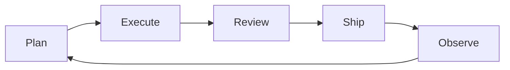

# Engineer Work Matrix

This document captures what a software engineer needs to complete daily work accurately, and maps which parts Codex/Claude can solve or accelerate.

**At A Glance**

**Daily Job Matrix**

| Area | Goal | Inputs Needed | Outputs | Quality Bar | Codex/Claude Role |
| --- | --- | --- | --- | --- | --- |
| Planning | Choose correct work | Roadmap, backlog, priorities | Selected tasks | Aligned with team goals | Summaries + ranking |
| Execution | Build correctly | Repo, tests, specs | Code + tests | Passes tests, correct behavior | Draft patches + tests |
| Review | Reduce risk | Diff, context, runtime signals | Approvals, fixes | No critical regressions | Risk scan + checklist |
| Ship | Release safely | CI, deploy config | Release + notes | Rollback ready | Draft notes |
| Observe | Catch issues | Metrics, logs, alerts | Actions, fixes | SLA met | Alert summaries |
| Communicate | Keep team aligned | Status, blockers | Updates | Timely, clear | Draft updates |

**Planning Matrix**

| Step | Inputs | Decision | Artifact |
| --- | --- | --- | --- |
| Scope | Roadmap, KPIs | What matters now | Sprint goal |
| Decompose | Feature spec | Task breakdown | Tasks + estimates |
| Sequence | Dependencies | Order of work | Plan |
| Risk | Past incidents | Mitigations | Risk list |
| Align | Team capacity | Commitments | Owner map |

**Execution Matrix**

| Step | Inputs | Action | Artifact | Codex/Claude Role |
| --- | --- | --- | --- | --- |
| Understand | Codebase, docs | Read + inspect | Notes | Summaries + pointers |
| Implement | Tasks, design | Code changes | PR | Draft changes |
| Validate | Tests, linters | Run checks | Green CI | Suggest tests |
| Integrate | Reviews, fixes | Resolve feedback | Updated PR | Patch revisions |
| Merge | Approved PR | Merge | Release | Draft release notes |

**Project Management Matrix**

| Area | Inputs | Actions | Outputs |
| --- | --- | --- | --- |
| Backlog | Issues, requests | Triage, label | Ordered backlog |
| Scheduling | Capacity, priority | Plan sprint | Sprint board |
| Risk | Dependencies | Mitigate | Risk register |
| Status | Progress signals | Update | Stakeholder report |

**Codex/Claude Capability Matrix**

| Task | Can Automate | Needs Human | Inputs Required | Safety Gate |
| --- | --- | --- | --- | --- |
| Summarize issues/PRs | Yes | Approvals | Diff, comments | Review |
| Draft tasks from text | Yes | Final review | Text + context | Confirm |
| Generate test cases | Yes | Final review | Code + spec | Review |
| Implement small changes | Yes | Review + merge | Repo + target | Review |
| Propose refactor | Yes | Approval | Codebase | Approval |
| Runbooks execution | Yes | Confirmation | Runbook + scope | Confirm |
| CI triage | Yes | Decision | Logs + failures | Confirm |
| Incident update draft | Yes | Approval | Incident data | Approval |
| Sprint status | Yes | Approval | Activity signals | Approval |
| Architecture decisions | No | Yes | Domain context | Human only |
| Security approvals | No | Yes | Policy context | Human only |

**Automation Strategy**

| Stage | What To Automate First | Why | Gate |
| --- | --- | --- | --- |
| Planning | Summaries, task drafts | Reduces prep time | Confirm |
| Execution | Small code changes | Safe and fast | Review |
| Review | Diff analysis, test suggestions | Reduces risk | Review |
| Ship | Release notes | Low risk, high value | Approve |
| Observe | Log summaries | Faster response | Confirm |
| Communicate | Status drafts | Reduces overhead | Approve |
