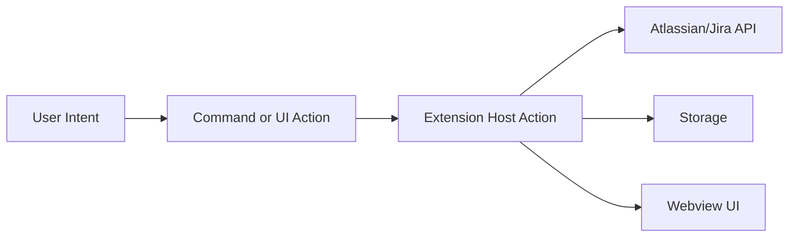

# External App Interactions Matrix

This document standardizes how the extension talks to Atlassian/Jira, which actions become commands, and how we choose the main commands.

**Purpose**

1. Make external integrations explicit, testable, and consistent.
2. Keep the command surface small and high‑value.
3. Separate user intent from background sync and UI actions.

**Visual Overview**



**Object Model**

| Object | Example | Notes |
| --- | --- | --- |
| Issue | `ABC-123` | Core entity shown in the tree and webview |
| Project | `ABC` | Used for filtering and display |
| User | `currentUser()` | Used in JQL and display |
| Auth | API token | Determines headers and endpoints |
| Query | JQL string | Drives list results |

**Action Taxonomy**

| Category | Example Actions | Notes |
| --- | --- | --- |
| `AUTH_*` | `AUTH_CONNECT`, `AUTH_DISCONNECT`, `AUTH_REFRESH` | Credentials and session |
| `ISSUES_*` | `ISSUES_LIST`, `ISSUES_OPEN`, `ISSUES_DETAILS` | Primary workflow |
| `SEARCH_*` | `SEARCH_JQL` | JQL queries and filters |
| `NAV_*` | `NAV_OPEN_APP`, `NAV_OPEN_ISSUE` | Navigation only |
| `SETTINGS_*` | `SETTINGS_SYNC_ENV`, `SETTINGS_OPEN` | Configuration flow |
| `DEV_*` | `DEV_RELOAD`, `DEV_RESTART_HOST` | Developer tooling |

**Interactions Matrix**

| Domain | Action | User Value | API Call | Auth | Storage Touch | Webview Surface | Command? |
| --- | --- | --- | --- | --- | --- | --- | --- |
| Auth | Connect (API token) | High | none | API token | secrets + settings | Setup | Yes |
| Issues | List sprint issues | High | `search/jql` | token | settings + cache | Overview | No |
| Issues | Open issue | High | `issue/{key}` | token | none | Jira detail | Yes |
| Issues | Open in browser | Medium | `issue/{key}` | token | none | Jira detail | No |
| Issues | Refresh issues | High | `search/jql` | token | cache | Overview | Yes |
| Search | Custom JQL | Medium | `search/jql` | token | settings | Overview | No |
| Meta | Fetch projects | Medium | `project/search` | token | cache | Setup | No |
| Meta | Fetch fields | Low | `field` | token | cache | Setup | No |

**Choosing Main Commands**

We only promote actions to commands when they are high‑value and not easily discoverable in the UI.

**Scoring Rule**

```text
score = (frequency * 3) + (value * 3) - (discoverability * 2) - (risk * 2) - (latency * 1)
```

**Command Promotion Checklist**

1. High user value.
2. Frequent or urgent.
3. Not already obvious in the UI.
4. Low risk of destructive action.
5. Does not require multiple parameters.

**Command Design Rules**

1. Command names are verbs and specific.
2. Commands default to safe behavior.
3. Parameters are minimal and contextual.
4. A command should do one thing.

**Recommended Main Commands**

| Command | Purpose |
| --- | --- |
| `atlassian.openApp` | Open the main UI |
| `atlassian.login` | Connect to Jira |
| `atlassian.refresh` | Refresh issue list |
| `atlassian.openIssue` | Open a specific issue |
| `atlassian.syncEnvToSettings` | Sync `.env.local` to settings |

**When Not To Add A Command**

1. The action is already a button or link in the UI.
2. The action is low‑frequency or low‑impact.
3. The action is only useful for debugging.
4. The action would need too many parameters.

**Storage Touchpoints**

| Data | Storage | Notes |
| --- | --- | --- |
| Tokens | `context.secrets` | Always |
| Connection metadata | `context.globalState` | `baseUrl`, `email` |
| JQL, max results | Settings | User intent |
| Cached results | `storageUri` | Optional future cache |
