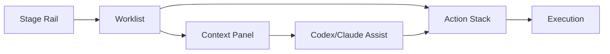

# Lifecycle UI With Codex/Claude

This document describes the UI layout for the lifecycle stages and how Codex/Claude accelerates each step without hiding critical decisions.

**UI Layout**

**Layout Rules**

1. The primary action always appears in the same location.
2. Stage navigation never moves the action stack.
3. AI suggestions are visible but never auto‑executed without confirmation.

**UI Zones**

| Zone | Purpose | Always Visible | Notes |
| --- | --- | --- | --- |
| Stage Rail | Plan → Execute → Review → Ship → Observe | Yes | Number keys for muscle memory |
| Worklist | Now / Next / Waiting | Yes | Stable ordering |
| Action Stack | Primary + 1–3 secondary | Yes | Constant position |
| Context Panel | Details and history | Optional | Expands on focus |
| AI Assist | Drafts, summaries, checklists | Optional | One click to accept |

**Codex/Claude Integration By Stage**

| Stage | AI Role | Typical Trigger | Output | Human Gate |
| --- | --- | --- | --- | --- |
| Plan | Summarize + rank | Open app or triage | Ranked tasks | Confirm selection |
| Execute | Draft code/tests | Open task or diff | Patch + tests | Review + edit |
| Review | Risk scan | PR opened | Checklist + notes | Approve or request changes |
| Ship | Release summary | Release ready | Notes + impact | Approve publish |
| Observe | Signal triage | Alert arrives | Summary + next steps | Confirm action |

**Automation Modes**

| Mode | What It Does | Default Use |
| --- | --- | --- |
| Assist | Drafts and suggestions only | Always safe |
| Guided | Executes after explicit confirmation | Use for routine tasks |
| Auto | Executes without confirmation | Reserved for low‑risk ops |

**Muscle Memory Keys**

| Key | Action |
| --- | --- |
| `1` | Plan |
| `2` | Execute |
| `3` | Review |
| `4` | Ship |
| `5` | Observe |
| `Enter` | Run primary action |
| `Shift+Enter` | Run secondary action |

**Example: Execute Stage**

| Slot | Action | AI Assist |
| --- | --- | --- |
| Primary | Resume Task | Generate patch |
| Secondary | Run Tests | Draft test plan |
| Secondary | Open PR | Draft PR summary |

**Lifecycle Reminders**

Reminder screens are defined in `docs/project-management-matrix.md`.
