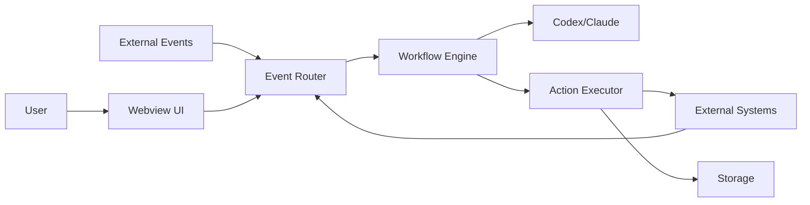

# Main App Usage Matrix

This document defines the primary workflows for the Codex/Claude automation extension and the standardized communication contract across external systems.

**At A Glance**



**Primary Workflows**

| Workflow | Trigger | Inputs | Codex/Claude Role | Outputs | Surface |
| --- | --- | --- | --- | --- | --- |
| Triage Inbox | App open or command | Issues/PRs/messages | Summarize, prioritize | Ranked list + next steps | Overview |
| Create Task | Command or selection | Text + context | Extract fields | New Jira/Linear issue | Create form |
| Review PR | PR opened or command | Diff + checks | Summarize risk | Review checklist + comment | PR detail |
| Status Update | Scheduled or command | Activity + issues | Draft update | Slack/Linear update | Status view |
| Incident Assist | Alert or message | Alert payload | Suggest response | Ticket + Slack update | Incident view |

**Workflow Selection Rule**

1. Use a workflow when it can be triggered by a single intent.
2. If it needs multiple independent inputs, keep it as a multi-step UI flow.
3. Favor read‑heavy automation first, then add write actions.

**Main Commands**

These are the top‑level commands users should rely on daily.

| Command | Purpose |
| --- | --- |
| `automation.openApp` | Open the main UI |
| `automation.triage` | Run triage inbox |
| `automation.createTask` | Create a task from selection |
| `automation.refresh` | Refresh external data |
| `automation.connect` | Connect integrations |

**Codex/Claude Assist Points**

| Surface | Assist Type | Default Behavior |
| --- | --- | --- |
| Overview | Triage ranking | Suggested order only |
| Create | Field extraction | Prefill form |
| PR Detail | Risk summary | Checklist + notes |
| Status | Draft update | Requires approval |
| Incident | Suggested response | Requires confirmation |

**Normalized Event Envelope**

All external events map into this shape before routing.

```ts
export type ExternalEvent = {
  id: string;
  type: string;
  source: "github" | "gitlab" | "jira" | "linear" | "slack" | "confluence" | "notion" | "calendar" | "email";
  actor?: { id?: string; name?: string; email?: string };
  time: string;
  resource?: { type: string; id?: string; url?: string; title?: string };
  workspace?: { id?: string; name?: string };
  payload: Record<string, unknown>;
};
```

**Communication Matrix: Inbound Events**

| System | Event Type | Required Payload | Normalized Resource | Default Action |
| --- | --- | --- | --- | --- |
| GitHub | `github:pull_request.opened` | `repo`, `prNumber`, `title`, `author`, `url` | `resource.type=pr` | `REVIEW_PR` |
| GitHub | `github:issue.opened` | `repo`, `issueNumber`, `title`, `author`, `url` | `resource.type=issue` | `TRIAGE` |
| Jira | `jira:issue.updated` | `issueKey`, `summary`, `status`, `url` | `resource.type=issue` | `SYNC_STATUS` |
| Linear | `linear:issue.created` | `issueId`, `title`, `state`, `url` | `resource.type=issue` | `TRIAGE` |
| Slack | `slack:message.mention` | `channel`, `user`, `text`, `ts`, `permalink` | `resource.type=message` | `CREATE_TASK` |
| Calendar | `calendar:event.started` | `eventId`, `title`, `start`, `participants` | `resource.type=event` | `STATUS_UPDATE` |
| Email | `email:inbound` | `from`, `subject`, `body`, `messageId` | `resource.type=email` | `TRIAGE` |

**Communication Matrix: Outbound Actions**

| System | Action | Required Params | Idempotency Key | Trigger |
| --- | --- | --- | --- | --- |
| GitHub | `comment_pr` | `repo`, `prNumber`, `body` | `prNumber+hash` | Review PR |
| GitHub | `create_issue` | `repo`, `title`, `body`, `labels` | `title+hash` | Create task |
| Jira | `create_issue` | `projectKey`, `summary`, `description`, `issueType` | `summary+hash` | Create task |
| Jira | `transition_issue` | `issueKey`, `transitionId` | `issueKey+transitionId` | Status update |
| Linear | `create_issue` | `teamId`, `title`, `description`, `labels` | `title+hash` | Create task |
| Slack | `post_message` | `channel`, `text` | `channel+hash` | Status update |
| Confluence | `create_page` | `spaceKey`, `title`, `body` | `title+hash` | Status report |

**Payload Guidance**

1. Always include a stable id and a URL when available.
2. Prefer text fields that are already normalized by the source system.
3. Keep `payload` as the raw event body so we can re‑process when needed.

**Storage Touchpoints**

| Data | Storage | Notes |
| --- | --- | --- |
| Tokens | `context.secrets` | Always |
| Integration config | Settings | User intent |
| Sync checkpoints | `globalState` | Cursor per system |
| Cached payloads | `storageUri` | Per workspace |
| LLM summaries | `storageUri` | Derived data |

**What Not To Automate**

1. Actions that can irreversibly delete or merge.
2. Actions requiring multi‑step approvals without explicit confirmation.
3. Anything that can’t be expressed as a single intent.

**Related Docs**

- `docs/engineer-work-matrix.md`
- `docs/project-management-matrix.md`
- `docs/lifecycle-ui.md`
