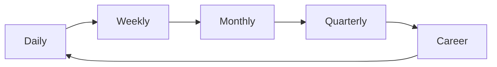

# Project Management and Lifecycle Matrix

This document defines the cadence, communication, and reminder system from daily execution to long‑term career growth.

**At A Glance**

**Lifecycle Layers**

| Layer | Horizon | Primary Goal | Inputs | Outputs |
| --- | --- | --- | --- | --- |
| Micro | Daily | Deliver today’s outcomes | Tasks, blockers, PRs | Completed work |
| Meso | Weekly | Maintain momentum | Sprint plan, backlog | Sprint progress |
| Macro | Monthly/Quarterly | Deliver outcomes | Initiatives, KPIs | Milestones shipped |
| Career | 1–2 years | Grow impact | Portfolio, feedback | Growth plan |

**Initiatives and Projects**

| Level | Artifact | Owner | Cadence | Success Signal |
| --- | --- | --- | --- | --- |
| Initiative | Strategy brief | Lead | Quarterly | KPI movement |
| Project | Plan + milestones | PM/Lead | Monthly | Milestones hit |
| Sprint | Sprint plan | Team | Weekly | Scope delivered |
| Task | Ticket | IC | Daily | Completion |

**Communication Matrix**

| Audience | Cadence | Channel | Default Message |
| --- | --- | --- | --- |
| Team | Daily/Weekly | Standup/Slack | Today, blockers, help needed |
| Stakeholders | Weekly/Biweekly | Doc/Email | Progress, risks, ETA |
| Leadership | Monthly/Quarterly | Memo | Outcomes, learnings, next bets |
| Self | Monthly | Journal | Wins, gaps, growth focus |

**Cyclical Maintenance**

| Cycle | Purpose | Routine |
| --- | --- | --- |
| Daily | Keep flow | Triage → Execute → Review |
| Weekly | Adjust priorities | Plan + Retro + Groom |
| Monthly | Re‑calibrate | Roadmap check + risk sweep |
| Quarterly | Reset direction | OKR review + initiative scoring |

**Reminder Screens**

| Screen | Trigger | Primary CTA | Key Widgets |
| --- | --- | --- | --- |
| Daily Focus | App open | Start top task | Top 3 outcomes, blockers |
| Weekly Review | End of week | Plan next week | Wins, misses, risk list |
| Monthly Check‑in | Month end | Re‑align priorities | Initiative progress, drift |
| Quarterly Reset | Quarter end | Commit next bets | KPI review, milestones |
| Career Growth | Monthly | Update growth plan | Skills, feedback, stretch work |

**Automation Assist (Codex/Claude)**

| Layer | Assist | Output | Gate |
| --- | --- | --- | --- |
| Daily | Triage + prioritization | Ranked task list | Confirm |
| Weekly | Summary + risk sweep | Weekly update | Approve |
| Monthly | Drift detection | Priority suggestions | Confirm |
| Quarterly | Initiative scoring | Next bet options | Approve |
| Career | Growth suggestions | Goals + actions | Review |

**Signals That Trigger Reminders**

| Signal | Example | Screen |
| --- | --- | --- |
| Blockers exceed threshold | 3+ blocked tasks | Daily Focus |
| Sprint drift | 20% scope at risk | Weekly Review |
| Initiative slippage | Milestone missed | Monthly Check‑in |
| KPI regression | Metric down for 2 cycles | Quarterly Reset |
| Growth gap | No stretch work in 60 days | Career Growth |

**Related Docs**

- `docs/reminder-ui.md`
