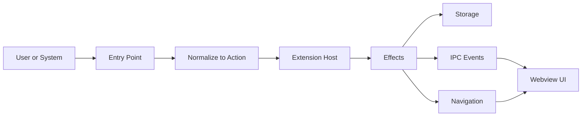
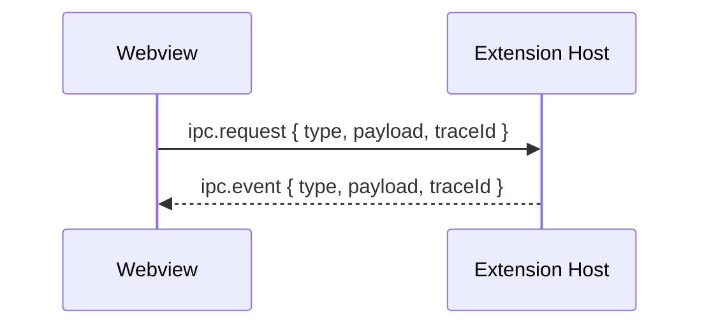
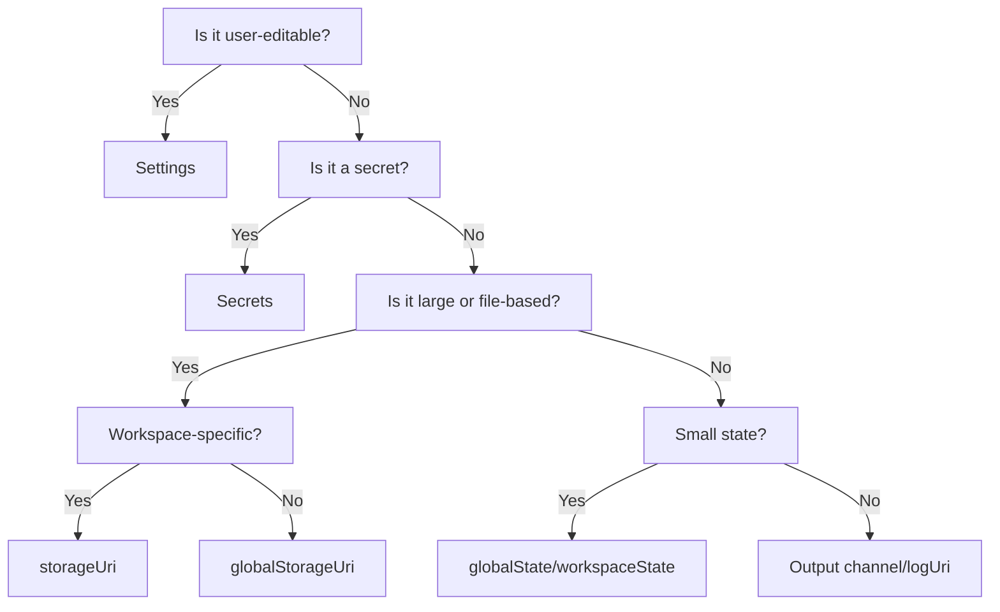

# Universal Routing Matrix

This is the visual map for how the extension behaves from a user’s action to the UI and storage.

**At A Glance**



**Why This Exists**

1. One consistent flow from entry point to storage and UI.
2. Clear ownership: the extension host owns state, the webview requests it.
3. Predictable behavior across desktop, remote, and web.

**The One Path**

1. Something happens: command, deep link, tree click, webview action.
2. Normalize it into an `Action`.
3. The extension host produces `Effect`s.
4. Effects update storage and/or navigation.
5. The webview renders the result.

**Action Contract**

```ts
export type Action = {
  type: string;
  payload?: Record<string, unknown>;
  source: "uri" | "command" | "webview" | "internal";
  traceId: string;
  workspaceId?: string;
};
```

**Effect Contract**

```ts
export type Effect = {
  reads?: string[];
  writes?: string[];
  navigate?: RouteHint;
  ipc?: Array<{ type: string; payload?: unknown }>;
};
```

**Route Contract**

```ts
export type RouteHint = {
  name?: string;
  path?: string;
  issueKey?: string;
  query?: Record<string, string>;
};
```

**IPC Contract**



Every IPC message includes `type`, `payload`, and `traceId`.

**Routing Map**

| Entry Point | Parser | Action Type | Storage Reads/Writes | IPC/Navigation | Notes |
| --- | --- | --- | --- | --- | --- |
| Deep link | URI handler → `RouteHint` | `NAVIGATE` | Read settings and auth state | IPC `navigate(route)` | External routing entry |
| Command palette | Command handler | `OPEN_APP`, `LOGIN`, `LOGOUT`, `REFRESH`, `OPEN_ISSUE` | Read settings and auth | IPC `showApp` then `navigate` | User-intended actions |
| Tree item click | `TreeItem.command` | `OPEN_ISSUE` | Read issue details | IPC `navigate(issue)` | UI-driven navigation |
| Webview action | IPC request | `SAVE_TOKEN`, `SYNC_ENV`, `OPEN_SETTINGS` | Write secrets, settings, state | IPC `stateUpdated` | Webview never writes storage |
| Background task | Timer/event | `REFRESH_ISSUES` | Read auth + settings | IPC `issuesUpdated` | Optional, throttled |
| Activation | `activate()` | `BOOTSTRAP` | Read settings, secrets, state | IPC `stateLoaded` | Initializes caches and UI |

**Where Data Lives**

| Data Type | Where It Lives | API | Sync | Example |
| --- | --- | --- | --- | --- |
| User config | Settings | `workspace.getConfiguration()` | Yes | `baseUrl`, `jql`, `maxResults` |
| Secrets | Secret store | `context.secrets` | No | API token, OAuth access/refresh |
| Auth metadata | Global state | `context.globalState` | Optional | `authType`, `expiresAt`, `cloudId` |
| Workspace cache | Workspace storage | `context.storageUri` | No | per-workspace issue cache |
| Global cache | Global storage | `context.globalStorageUri` | No | shared cache |
| Small state | Global or workspace state | `globalState` / `workspaceState` | Optional / No | reopen-after-restart |
| Logs | Output channel or log URI | `createOutputChannel` / `context.logUri` | No | structured logs |

**Storage Decision Tree**



**Operational Rules**

1. Use `vscode.workspace.fs` for `storageUri` and `globalStorageUri` to keep web and remote compatibility.
2. Use settings only for user-intent configuration.
3. Use `context.secrets` for anything sensitive.
4. Do not store large data in settings or state KVs.
5. `.env` and `.env.local` are development-only inputs; functionality must not depend on them.

**Standard Storage Wrapper**

We use one wrapper to keep persistence consistent and host-safe.

| Item | Value |
| --- | --- |
| Location | `src/extension/service/storage-service.ts` |
| Uses | settings, state, secrets, and file storage via `workspace.fs` |

**Atlassian Extension Mapping**

| Capability | Current Location | Notes |
| --- | --- | --- |
| Deep links | `src/extension/service/uri-handler.ts` | Resolves `RouteHint` and navigates |
| Commands | `src/extension/extension.ts` | All public actions wired here |
| Webview IPC | `src/webview/src/ipc` and `src/webview/src/contexts/jsonrpc-rx-context.tsx` | IPC transport |
| Settings read/write | `src/extension/providers/data/atlassian/atlassianConfig.ts`, `src/extension/handlers/settings.ts` | Standard settings usage |
| Secrets | `src/extension/providers/data/atlassian/atlassianClient.ts` | API token + OAuth tokens |
| Auth metadata | `src/extension/providers/data/atlassian/atlassianClient.ts` | `globalState` keys |
| Restart flags | `src/extension/constants.ts`, `src/extension/extension.ts` | `globalState` flag |
| Logs | `src/extension/providers/data/atlassian/logger.ts` | Output channel |

**Examples**

| Flow | Action | Effect | IPC |
| --- | --- | --- | --- |
| Open issue | `OPEN_ISSUE` | `navigate(/jira/issues/{key})` | `navigate` |
| Save token | `SAVE_TOKEN` | write `secrets`, update settings, update `globalState` | `stateUpdated` |
| Sync `.env.local` | `SYNC_ENV` | update workspace settings, update secrets | `stateUpdated` |
